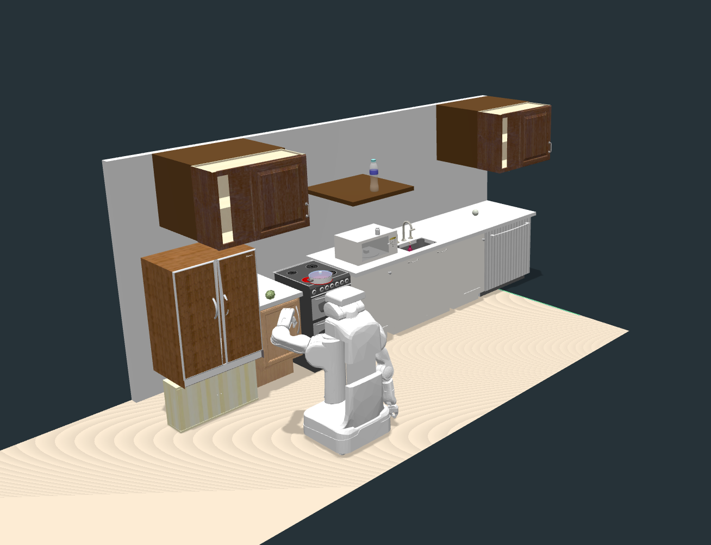

# lisdf-loaders

[Demo Here!](https://zt-yang.github.io/lisdf-loaders/javascript/example/bundle/index.html)



## Installation

To develop locally:

```shell
cd javascript
npm install
npm run build-examples
```

To use await when playing animation:

```shell
npm install --save regenerator-runtime
```

## Deploy

Settings > Actions > General > Workflow permissions > select "Read and write permissions".

Settings > Pages > Build and deployment > Source > select "Github Actions" > create "Deploy static content to Pages" workflow.

## TODO

- [x] Load static `.lisdf` files
  - [x] Support scale
  - [x] Support MTL
  - [x] Fix axes problem
- [x] Load animation `.json` files
  - [x] Object rotation problem
- [x] Embed static scenes into websites
  - [x] Make object joints interactive
  - [ ] Menu choose scenes and problems
- [ ] Drag and drop `.lisdf` files
- [ ] Drag and drop folder with `scene.lisdf` and `animation.json` files

# LICENSE

The software is available under the [Apache V2.0 license](./LICENSE).

Copyright © 2020 California Institute of Technology. ALL RIGHTS
RESERVED. United States Government Sponsorship Acknowledged.
Neither the name of Caltech nor its operating division, the
Jet Propulsion Laboratory, nor the names of its contributors may be
used to endorse or promote products derived from this software
without specific prior written permission.
